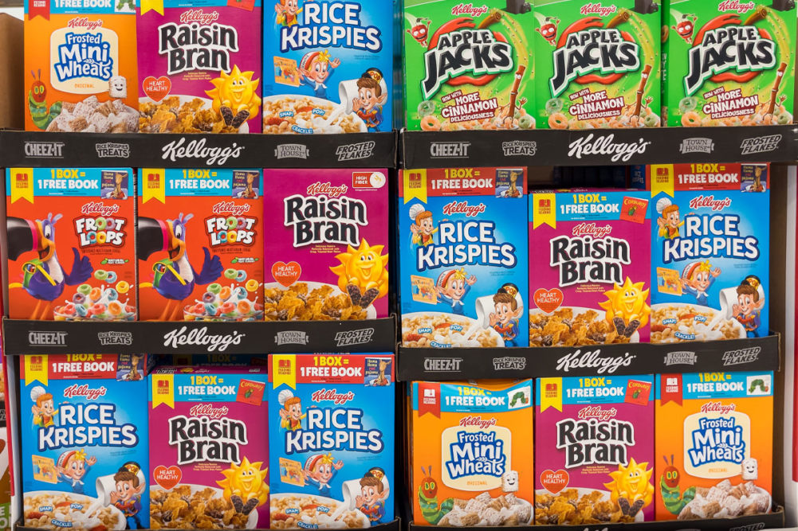

# Cereals Analysis

# Introduction:
## This Power BI project delves into the analysis of 80 different cereals, offering valuable insights into various aspects such as manufacturers, consumer preferences, and nutritional content including calories, vitamins, protein, and sugar levels.

# Content:
## The dataset contains the following fields:
Name: Name of cereal
mfr: Manufacturer of cereal
A = American Home Food Products;
G = General Mills
K = Kelloggs
N = Nabisco
P = Post
Q = Quaker Oats
R = Ralston Purina
type:
cold
hot
calories: calories per serving
protein: grams of protein
fat: grams of fat
sodium: milligrams of sodium
fiber: grams of dietary fiber
carbo: grams of complex carbohydrates
sugars: grams of sugars
potass: milligrams of potassium
vitamins: vitamins and minerals - 0, 25, or 100, indicating the typical percentage of FDA recommended
shelf: display shelf (1, 2, or 3, counting from the floor)
weight: weight in ounces of one serving
cups: number of cups in one serving
rating: a rating of the cereals (Possibly from Consumer Reports?)

# Problem statement:
- what manufacturers has the highest protein?
- What manufactures has the highest calories?
- Which manufacturer has the highest count?
- What is the cereals preference of the consumers?
- Which shelf has the highest number of cereals?

# Visualization:
## This report comprises 2 pages:

- Cereals Dashboard

- Nut/Shelf Disribution

Recommendations:
- Better Shelf Spots: Put Kellogg's cereals where people can see them easily, like on the top shelf.

- More Choices: Keep adding new types of cereals to Kellogg's lineup, especially in different sizes.

- Healthy Highlight: If General Mills cereals have lots of protein, make sure people know about it.

- Quality Matters: Make sure Ralston Purina cereals taste great and are high quality to keep customers happy.

- Get Noticed: Try to have more Kellogg's cereals available and make sure they're easy to find in stores.

